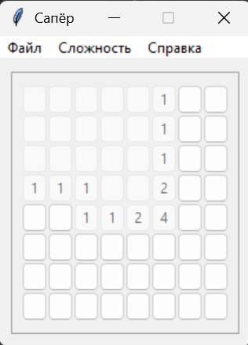

# Проект: игра Сапёр

Классическая игра Сапёр реализованная на Python с графическим интерфейсом на Tkinter

### Правила игры

Цель: открыть все клетки на поле, не содержащие мины
            
При открытии клетки, если в ней нет мины,
то показывается число, обозначающее количество мин в соседних клетках.
Игроки используют эти числа, чтобы определить местонахождение мин и помечать их флажками.

### Требования к библиотекам

Игра разработана на python 3.13.5. Для тестирования установлен модуль pytest

### Требования для запуска

- Клонировать репозиторий
- Запустить файл [main.py](main.py)
